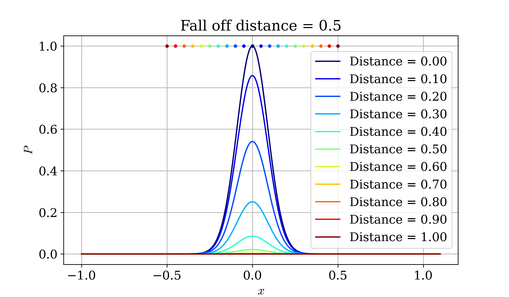
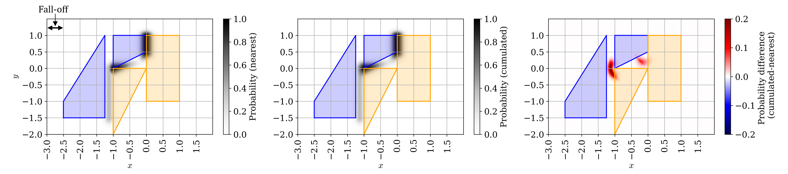
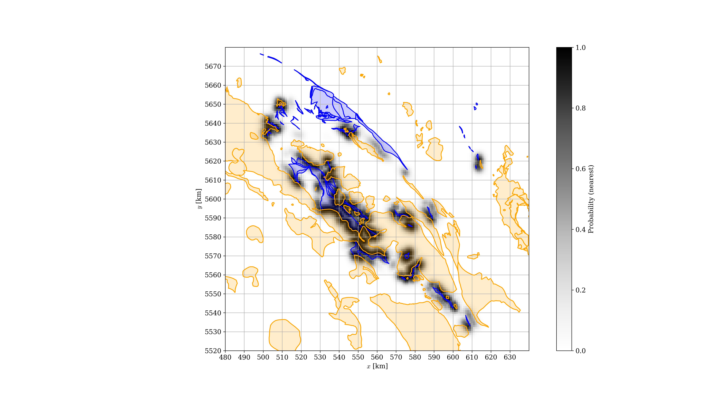
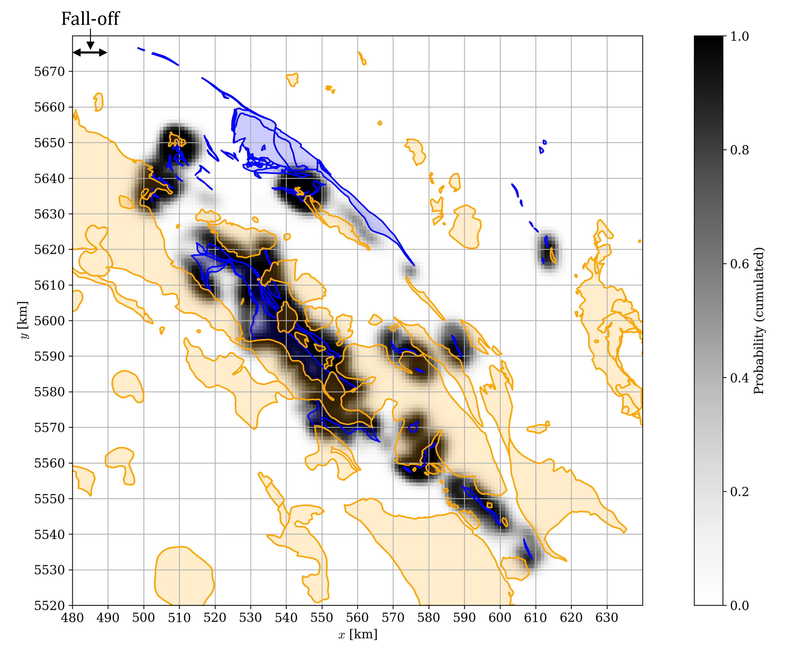

# GeOMA
Geological Ore Mapping Algorithm

# Mathematical model
Drawing a probability map is equivalent to estimating at the $i,j$ grid point the probability of finding the target mineral, conditional on a given distribution of generating rocks of type $G$ and $S$. This can be expressed as:

$P_{i,j}(C| G \cap S)$ 

where $G \equiv g_1 \cap g_2 ... \cap g_n$  and $S \equiv s_1 \cap s_2 ... \cap s_n$ are in turn the union of several polygons in the geological map.

Accounting for the influence of regional rock distribution is both computationally challenging and impractical, considering that only rocks in proximity to the point of interest dominate the geological process. Therefore, the former equation is solved using two approximations.

With the **nearest probability**, we just consider the influence of the rock formations of both types that are the nearest to the point of interest [Bonham-Carter, 1994](https://www.sciencedirect.com/book/monograph/9780080418674/geographic-information-systems-for-geoscientists). In formula:

  $P_{i,j}(C| G \cap S) \sim P_{i,j}(C| g_{near} \cap s_{near}$
  
The pros are:
- simple implementation in shapely
- fast and scalable computation
- conservative approach
The cons are:
- it does not consider the influence of multiple rock formations
- it may underestimate resource probability

The **cumulated probability** approach considers the total probability as a superposition of the individual probability maps generated by each pair of polygons. By assuming each pair of polygons to induce geological processes that are statistically independent from each other, the superposition can be carried out as:
 $P_{i,j}(C| G \cap S) \sim 1- \prod (1-P_{i,j}(C| G \times S))$,
where $\times$ indicates the Cartesian product between polygon pairs. The formula can be either interpreted as the complementary probability of the joint probability of C "NOT occurring" [Sheldon, 2019](https://www.cs.utexas.edu/~abdonm/SDS%20321/a_first_course_in_probability.pdf), or as a fuzzy algebraic sum [Bonham-Carter, 1994](https://www.sciencedirect.com/book/monograph/9780080418674/geographic-information-systems-for-geoscientists). For instance, if there are 100 polygons of type G and 100 of type S, the total probability maps that are superposed are 10,000, a substantial increase in computational time compared to the nearest probability approach.

The pros are:
- it considers the influence of multiple rock formations
- it may reveal high probability regions where multiple rock pairs are present

The cons are:
- requires a dedicated function
- slow computation
- it may overestimate resource probability if the assumption of geological independence of individual pairs fails

The final step is to formulate an analytical function of the distance from both the rock types that satisfies the fall-off criterion. This repository adopts a double Gaussian function:

$P_{i,j}(C|g \cap s)=p_0 e^\frac{-r_g^2+r_s^2}{2 \sigma^2}$,

where:
- $p_0$ is the maximum probability for touching polygons (kept as 1 in the following)
- $r_g$ and $r_s$ is the Euclidean distance of the $i,j$ grid point from of rocks $g$ and $s$, respectively
- $\sigma$ is the Gaussian spreading, which for a given fall-off, $\Delta$, and a tolerance, $\gamma \ll 1$, is equal to $\sigma=\frac{\Delta}{2 \sqrt{2} \text{erf}^{-1}(1-\gamma)}$.

Figure 1 shows an example of the double Gaussian probability function for several rock separation distances. The probability peaks in the center between the two rocks and smoothly vanishes when the distance is larger than the fall-off, $\Delta=0.5$.

  
  <figcaption>Figure 1. Sample probability functions for different separation distances.</figcaption>

# Test case study
The probability mapping with the nearest and cumulated approached is tested for idealized rock geometries in "test.py". Figure 2 summarizes the results for two pairs of polygons. Both maps show the expected behavior, with differences between the two approaches mainly arising where multiple pairs interact with each other. As predicted, the cumulated approach shows higher probability in these regions, as well as a smoother map.

  
  <figcaption>Figure 2. Test probability maps using the nearest approach (left), the cumulated approach (middle), and their difference (right).</figcaption>

# Real-world mapping
The "mapper.py" script calculates probability heat maps using both approaches for a real geological map. For this example, we selected as type 1 rocks those that have either "ultramafic" as a class or "serpentinite" as a type, and as type 2 rocks those that have "granodioritic" in the type.

Figures 3 and 4 show the heat map built using the nearest and cumulated approach, respectively. The cumulated approach in this realistic case leads to significantly enlarged promising regions in proximity to the interfaces between the two rock types. Real geological maps can produce a significant cumulative geological interaction, which is captured by the cumulated approach, but not the nearest one. On the flipside, the cumulated approach takes 882 s on an Intel(R) Core(TM) Ultra 9 185H (2.30 GHz) Windows system, while the nearest only 1.8 s.

  
  <figcaption>Figure 3. Probability map using the nearest approach.</figcaption>

  
  <figcaption>Figure 4. Probability map using the cumulated approach.</figcaption>

